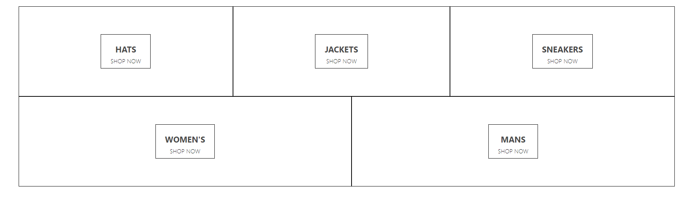
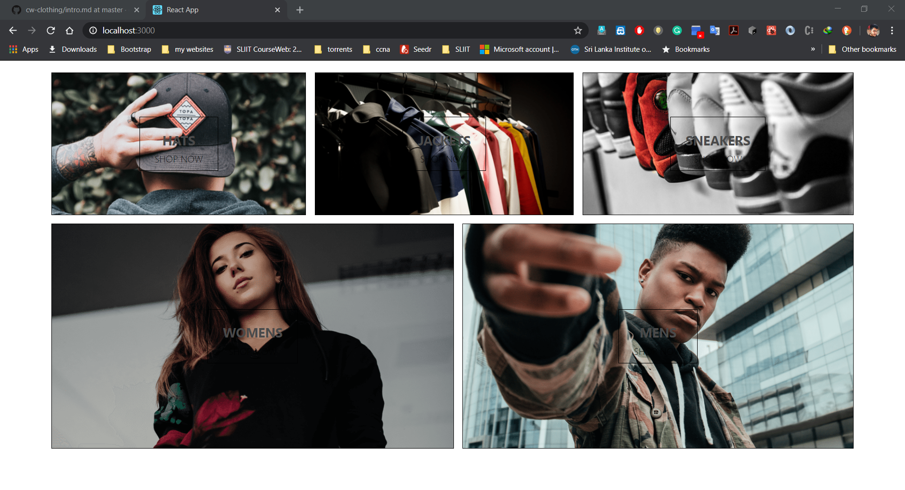
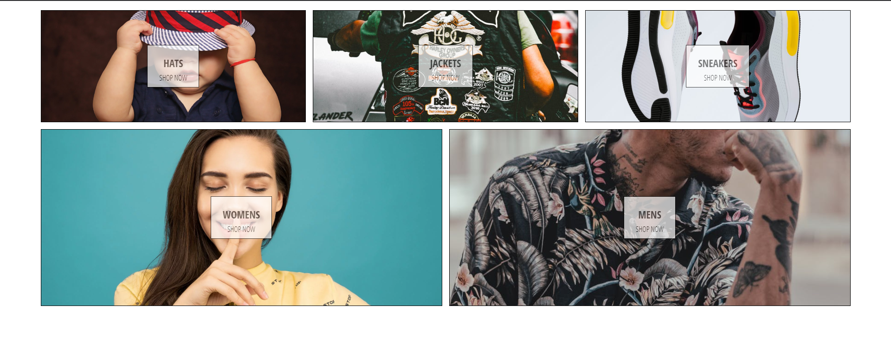

# **Create a React App**

```
npmx create-react-app cwclothing
```
## **Remove Unnecessary files**

### in `index.js` file

```javascript

// If you want your app to work offline and load faster, you can change
// unregister() to register() below. Note this comes with some pitfalls.
// Learn more about service workers: https://bit.ly/CRA-PWA
serviceWorker.unregister();

```

```html
  <header className="App-header">
        
        <p>
          Edit <code>src/App.js</code> and save to reload.
        </p>
        <a
          className="App-link"
          href="https://reactjs.org"
          target="_blank"
          rel="noopener noreferrer"
        >
          Learn React
        </a>
      </header>
```

## Creating Home Page
```jsx harmony
import React from "react";

const HomePAge = () => (
  <div className="homepage">
    <div className="directory-menu">
      <div className="menu-item">
        <div className="content">
          <h1 className="title">Hats</h1>
          <span className="subtitle">SHOP NOW</span>
        </div>
      </div>
      <div className="menu-item">
        <div className="content">
          <h1 className="title">JAckets</h1>
          <span className="subtitle">SHOP NOW</span>
        </div>
      </div>
      <div className="menu-item">
        <div className="content">
          <h1 className="title">Sneakers</h1>
          <span className="subtitle">SHOP NOW</span>
        </div>
      </div>
      <div className="menu-item">
        <div className="content">
          <h1 className="title">Women's</h1>
          <span className="subtitle">SHOP NOW</span>
        </div>
      </div>
      <div className="menu-item">
        <div className="content">
          <h1 className="title">Mans</h1>
          <span className="subtitle">SHOP NOW</span>
        </div>
      </div>
    </div>
  </div>
);

export default HomePAge;

```

## **Import it into `App.js`**

```jsx
import React from "react";
import HomePage from "./homePage.component";
import "./App.css";

function App() {
  return (
    <div>
      <HomePage />
    </div>
  );
}

export default App;

```

## **Installing `Node-Sass`**

```
npm i node-sass

```

## **Create a Style for HomePage**

```scss
.homepage {
  display: flex;
  flex-direction: column;
  align-items: center;
  //  y-20 x-80
  padding: 20px 80px;
}
.directory-menu {
  width: 100%;
  display: flex;
  flex-wrap: wrap;
  justify-content: space-between;
}

.menu-item {
  min-width: 30%;
  height: 240px;
  flex: 1 1 auto;
  display: flex;
  align-items: center;
  justify-content: center;
  border: 1px solid black;
  margin: 0 7.5px 15px;

  &.first-child {
    margin-right: 7.5px;
  }
  &.last-child {
    margin-left: 7.5px;
  }
  .content {
    height: 90px;
    padding: 0 25px;
    display: flex;
    flex-direction: column;
    align-items: center;
    justify-content: center;
    border: 1px solid black;
    text-transform: uppercase;
  }

  .title {
    font-weight: bold;
    margin-bottom: 6px;
    font-size: 22px;
    color: #4a4a4a;
  }
  .subtitle {
    font-weight: lighter;
    font-size: 16px;
  }
}

```



## **Creatin a Folder Structure**

1. ***Create a components folder***

1. ***Create a pages folder***

## **Directory component**

```jsx
import React, { Component } from "react";
import MenuItem from "../menu-items/menu-item.component";
import "./directory.style.scss";
class Directory extends Component {
  constructor(props) {
    super(props);

    this.state = {
      secction: [
        {
          title: "hats",
          imageUrl: "https://i.ibb.co/cvpntL1/hats.png",
          id: 1,
          linkUrl: "shop/hats"
        },
        {
          title: "jackets",
          imageUrl: "https://i.ibb.co/px2tCc3/jackets.png",
          id: 2,
          linkUrl: "shop/jackets"
        },
        {
          title: "sneakers",
          imageUrl: "https://i.ibb.co/0jqHpnp/sneakers.png",
          id: 3,
          linkUrl: "shop/sneakers"
        },
        {
          title: "womens",
          imageUrl: "https://i.ibb.co/GCCdy8t/womens.png",
          size: "large",
          id: 4,
          linkUrl: "shop/womens"
        },
        {
          title: "mens",
          imageUrl: "https://i.ibb.co/R70vBrQ/men.png",
          size: "large",
          id: 5,
          linkUrl: "shop/mens"
        }
      ]
    };
  }

  render() {
    return (
      <div className="directory-menu">
        {this.state.secction.map(({ title, imageUrl, id, size }) => (
          <MenuItem key={id} imageUrl={imageUrl} title={title} size={size} />
        ))}
      </div>
    );
  }
}

export default Directory;


```
## **Menu-item component**
```jsx
import React from "react";
import "./menu-item.style.scss";

const MenuItem = ({ title, imageUrl, size }) => (
  <div
    className={`menu-item ${size}`}
    style={{ backgroundImage: `url(${imageUrl})` }}
  >
    <div className="content">
      <h1 className="title">{title}</h1>
      <span className="subtitle">SHOP NOW</span>
    </div>
  </div>
);

export default MenuItem;


```
## **HomePage component**

```jsx
import React from "react";
import "./homepage.style.scss";
import Directory from "../../components/directory/directory.component";

const HomePAge = () => (
  <div className="homepage">
    <Directory />
  </div>
);

export default HomePAge;

change the menu-item componenet 
```





## **Styling the Main Menu**
***add this to `Menu-item component` 
```scss

.content{
    background-color: white;
    opacity: 0.7;
    position: absolute;
}

```
## **Adding Fonts to the Project**

***add The LInk to the `index.html`***

***in `App.css`***
```scss

body{
    font-family: 'Open Sans Condensed', sans-serif;

}

```

## **MenuItem component**

```jsx
import React from "react";
import "./menu-item.style.scss";

const MenuItem = ({ title, imageUrl, size }) => (
  <div
    className={`menu-item ${size}`}
   
  >
    <div
      className="background-image"
      style={{ backgroundImage: `url(${imageUrl})` }}
    />
    <div className="content">
      <h1 className="title">{title}</h1>
      <span className="subtitle">SHOP NOW</span>
    </div>
  </div>
);

export default MenuItem;

```

add this to MenuItem style
```scss
  .background-image {
    width: 100%;
    height: 100%;
    background-size: cover;
    background-position: center;
  }

  .content {
    height: 90px;
    padding: 0 25px;
    display: flex;
    flex-direction: column;
    align-items: center;
    justify-content: center;
    border: 1px solid black;
    text-transform: uppercase;
    background-color: white;
    opacity: 0.7;
    // ---------------------new--------->
    position: absolute;

    .menu-item {


  overflow: hidden;

  &:hover {
    cursor: pointer;
    & .background-image {
      transform: scale(1.1);
      transition: transform 6s cubic-bezier(0.25, 0.45, 0.45, 0.95);
    }
    & .content{
        opacity: 0.9;
    }
  }

  }

```

