# **Redux**
some component have state some component dont
this is a small project

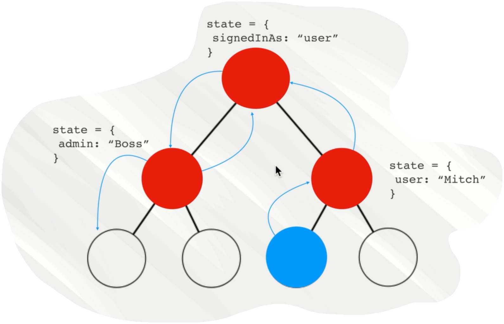

when the application gets complicated

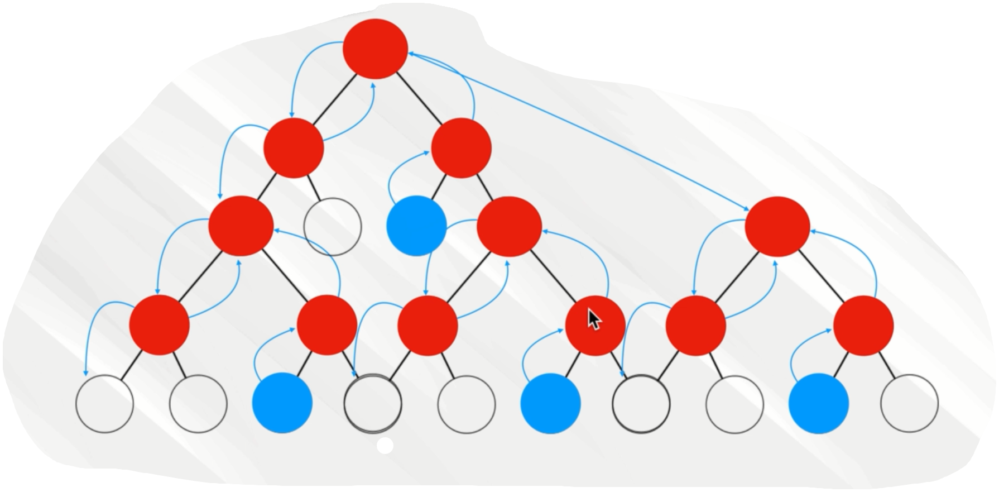

what redux did

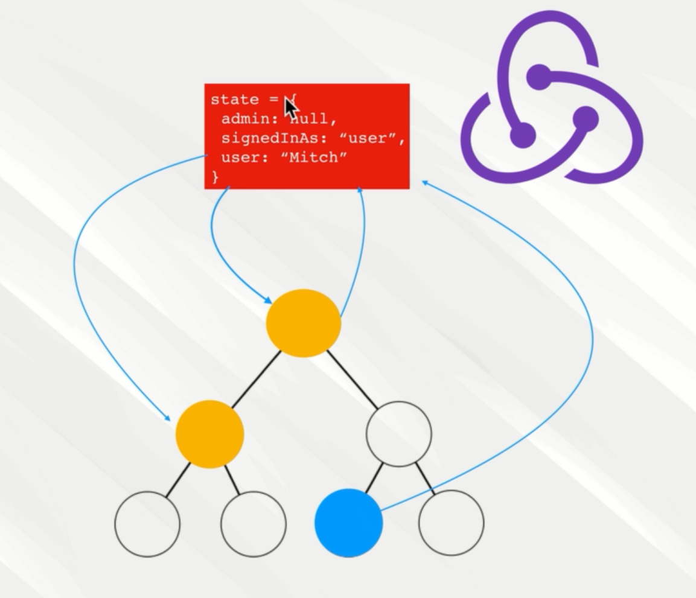

redux change the state from 

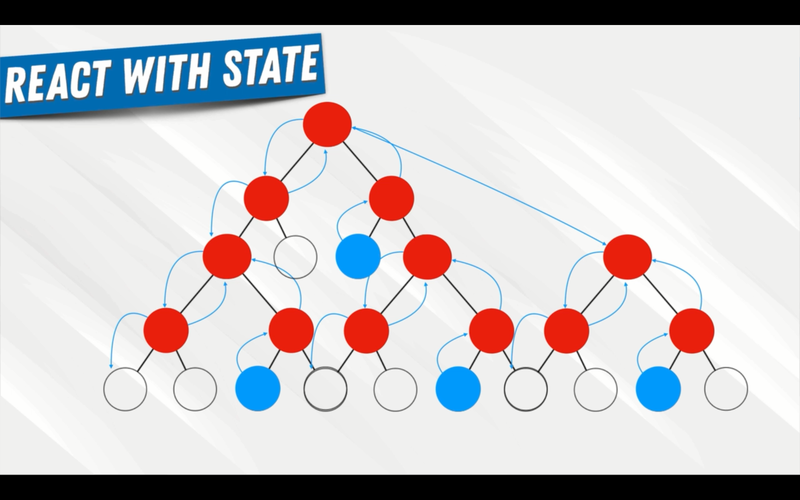

to this

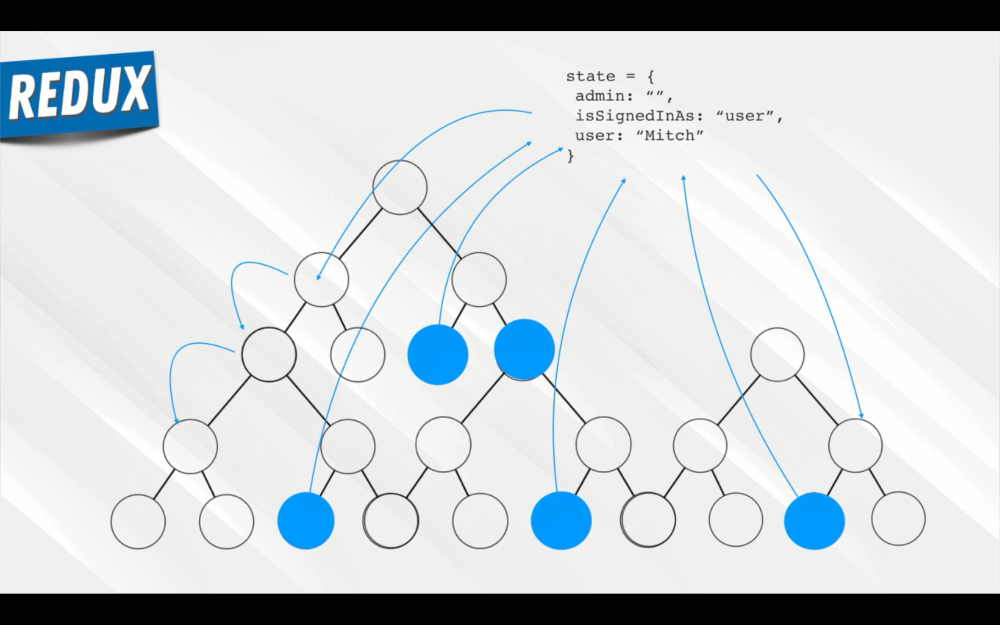


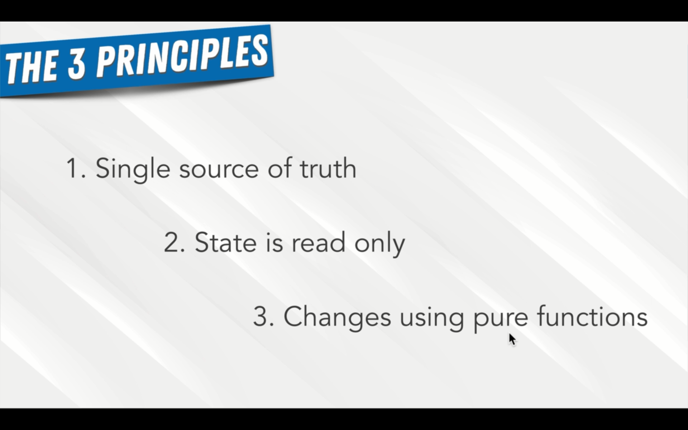
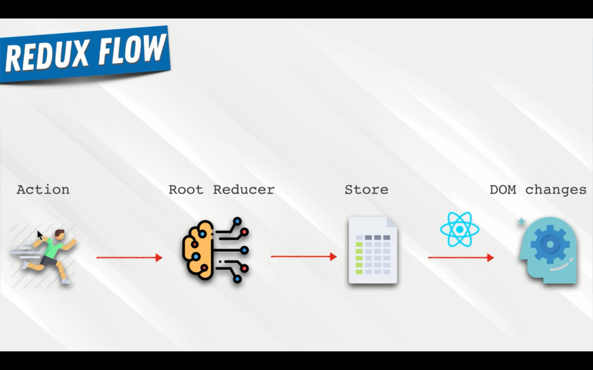

this is how old app work


with redux 


Redux architecher

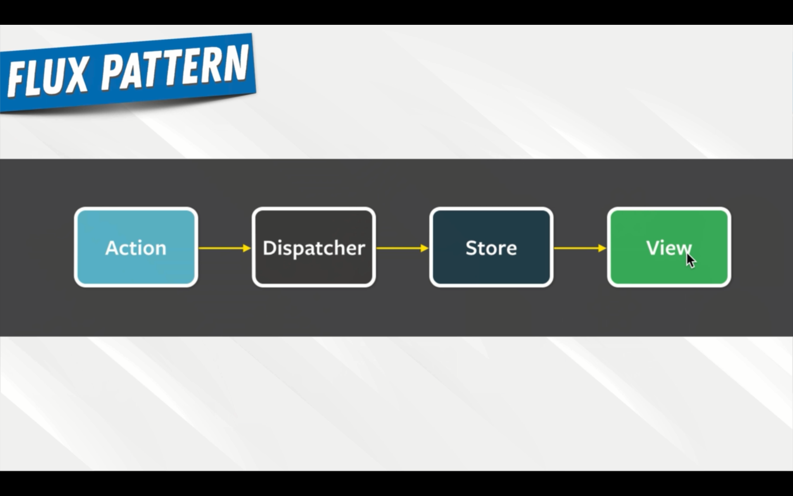

another technology

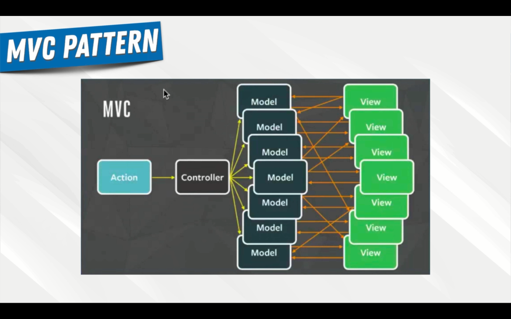

Prop Drilling

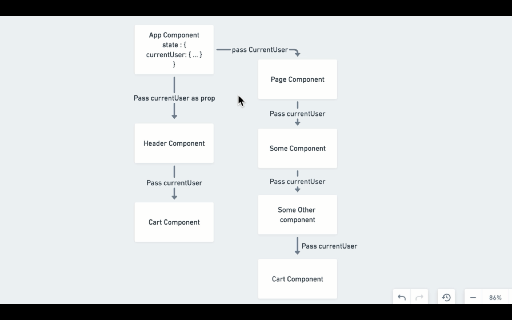

Redux Flow

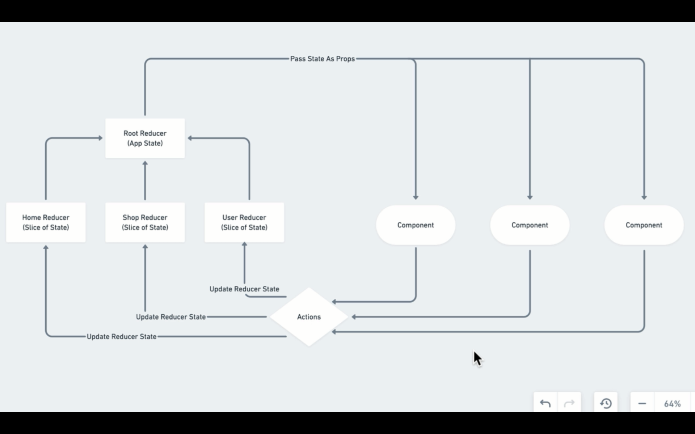

what is an action

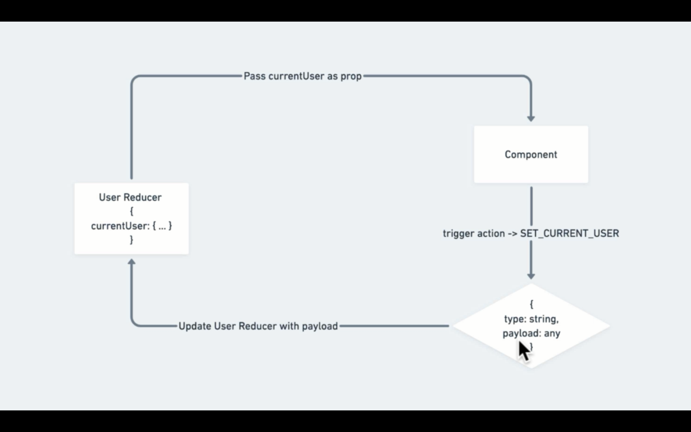
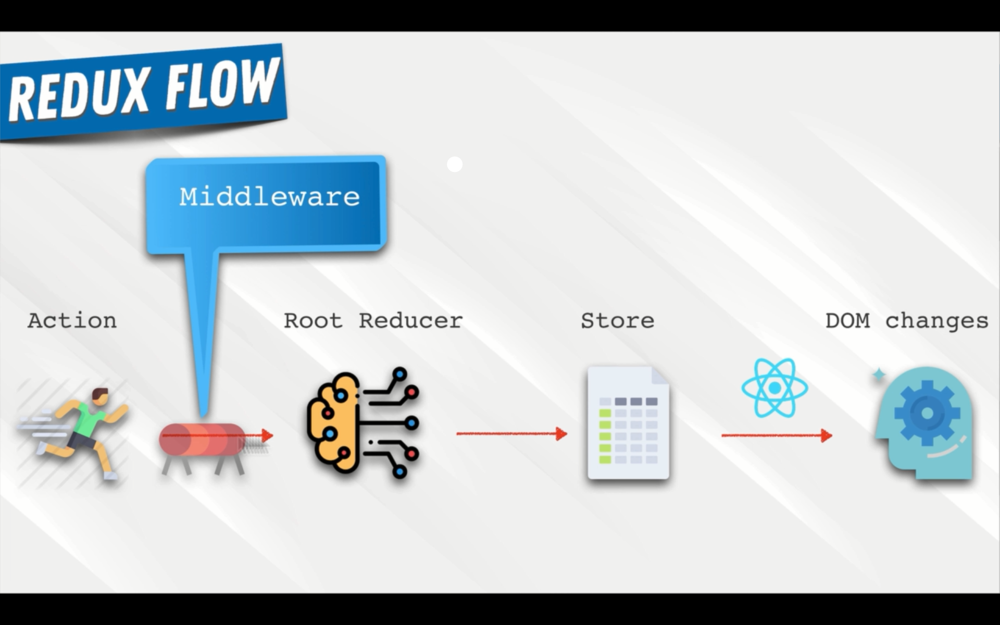

# **intergrating redux into our app**

install following packages

```
napm i redux redux-logger react-redux

```
go to `index.js`
```jsx
import {Provider} from 'react-redux';

```

```jsx

import React from "react";
import ReactDOM from "react-dom";
import "./index.css";
import App from "./App";
import { BrowserRouter } from "react-router-dom";
import {Provider} from 'react-redux'

ReactDOM.render(
-----------------------------------------
  <Provider>
    <BrowserRouter>
      <App />
    </BrowserRouter>
  </Provider>
-----------------------------------------
,
  document.getElementById("root")
);

```

now lets create a redux folder in src

in there create a root-reducer

and user folder

reducer is a function that gets two properties 
it gets a state object which represent a last state  or initial state
then it recives an action

action is an object 
 
```js
 {
    type:'',
    payload:''
}
```

lets create a user reducer

```js
const INITIAL_STATE = {
  currentUser: null
};

const UserReducer = (state = INITIAL_STATE, action) => {
  switch (action.type) {
    case "SET_CURRENT_USER":
      return {
        ...state,
        currentUser: action.payload
      };

    default:
      return state;
  }
};

export default UserReducer;


```

lets create the root reducer

```js
import { combineReducers } from "redux";
import UserReducer from "./user/user.reducer";

export default combineReducers({
  user: UserReducer
});

```

lets create a store 

create a store folder in src
inside create a store.js file

```js
import { createStore, applyMiddleware } from "redux";
import logger from "redux-logger";

import rootReducer from "../root-reducer";

const middleWares = [logger];

const store = createStore(rootReducer, applyMiddleware(...middleWares));

export default store;

```


apply the store in index.js

```js
import React from "react";
import ReactDOM from "react-dom";
import "./index.css";
import App from "./App";
import { BrowserRouter } from "react-router-dom";
import { Provider } from "react-redux";
import store from "./redux/store/store";

ReactDOM.render(
  <Provider store={store}>
    <BrowserRouter>
      <App />
    </BrowserRouter>
  </Provider>,
  document.getElementById("root")
);

```

lets create actions
create a file called `user.actions.js

```js
export const setCurrentUser = user => ({
  action: "SET_CURRENT_USER",
  payload: user
});

```
now our header component gets the current user from app.js but with redux we dont need that


inside the header component 

import `connect`
```js

import { connect } from "react-redux";

```
connect is a higher order component wich gives us access to redux functoions

```jsx
import React from "react";
import "./header.style.scss";
import { Link } from "react-router-dom";
import { ReactComponent as Logo } from "../../assets/crown.svg";
import { auth } from "../../firebase/firebase.utils";
import { connect } from "react-redux";

const Header = ({ currentUser }) => {
  return (
    <div className="header">
      <Link to="/" className="logo-container">
        <Logo className="logo"></Logo>
      </Link>
      <div className="options">
        <Link to="/shop" className="option">
          SHOP
        </Link>
        <Link to="/contact" className="option">
          CONTACT
        </Link>

        {currentUser ? (
          <div className="option" onClick={() => auth.signOut()}>
            SIGN OUT
          </div>
        ) : (
          <Link to="/signin">SIGN IN</Link>
        )}
      </div>
    </div>
  );
};
----------------------------------------------------------
const mapStateToProps = state => ({
  currentUser: state.user.currentUser
});
export default connect(mapStateToProps)(Header);
---------------------------------------------------------
```


and remove current user from app.js <Header>

```jsx
     <Header currentUser={this.state.currentUser} />
```

```jsx
     <Header  />
```

now modify the app.js 

```jsx
import React, { Component } from "react";

import HomePage from "./pages/homepage/homepage.component";
import "./App.css";
import { Route, Switch } from "react-router-dom";
import ShopPage from "./pages/shop/shop.component";
import Header from "./components/header/header.component";
import SignInSignUp from "./components/sign-in-and-sign-up/sign-in-and-sign-up.component";
import { auth, createUserProfileDoucument } from "./firebase/firebase.utils";

import { connect } from "react-redux";
----------------------------------------------------------------------------------------------------------
import { setCurrentUser } from "./redux/user/user.actions";
----------------------------------------------------------------------------------------------------------

class App extends Component {
  // beacuse this is a open subscription we have to close it
  // because we dont need any memory leaks in our application
  unsubscribeFromAuth = null;
  componentDidMount() {
----------------------------------------------------------------------------------------------------------

    const { setCurrentUser } = this.props;
----------------------------------------------------------------------------------------------------------

    this.unsubscribeFromAuth = auth.onAuthStateChanged(async userAuth => {
      if (userAuth) {
        const userRef = await createUserProfileDoucument(userAuth);

        userRef.onSnapshot(snapShot => {
----------------------------------------------------------------------------------------------------------

          setCurrentUser({ currentUser: snapShot.id, ...snapShot.data() });
        });
      } else {
        setCurrentUser(userAuth);
      }
    });
  }
----------------------------------------------------------------------------------------------------------

  // to close the subscription

  componentWillUnmount() {
    // this will close the subscription
    this.unsubscribeFromAuth();
  }
  render() {
    return (
      <div>
        <Header />
        <Switch>
          <Route exact path="/" component={HomePage} />
          <Route path="/shop" component={ShopPage} />
          <Route exact path="/signin" component={SignInSignUp}></Route>
        </Switch>
      </div>
    );
  }
}
----------------------------------------------------------------------------------------------------------

const mapDispatchToProps = dispatch => ({
  setCurrentUser: user => dispatch(setCurrentUser(user))
});

export default connect(null, mapDispatchToProps)(App);
----------------------------------------------------------------------------------------------------------

```

## how to redirect from signin page to home page whe the user signIn
import `Redirect` from react-router-dom;

```jsx
import React, { Component } from "react";
import HomePage from "./pages/homepage/homepage.component";
import "./App.css";
----------------------------------------------------------------------------------------------------------
import { Route, Switch, Redirect } from "react-router-dom";
----------------------------------------------------------------------------------------------------------

import ShopPage from "./pages/shop/shop.component";
import Header from "./components/header/header.component";
import SignInSignUp from "./components/sign-in-and-sign-up/sign-in-and-sign-up.component";
import { auth, createUserProfileDoucument } from "./firebase/firebase.utils";

import { connect } from "react-redux";
import { setCurrentUser } from "./redux/user/user.actions";

class App extends Component {
  // beacuse this is a open subscription we have to close it
  // because we dont need any memory leaks in our application
  unsubscribeFromAuth = null;
  componentDidMount() {
    const { setCurrentUser } = this.props;

    this.unsubscribeFromAuth = auth.onAuthStateChanged(async userAuth => {
      if (userAuth) {
        const userRef = await createUserProfileDoucument(userAuth);

        userRef.onSnapshot(snapShot => {
          setCurrentUser({ currentUser: snapShot.id, ...snapShot.data() });
        });
      } else {
        setCurrentUser(userAuth);
      }
    });
  }

  // to close the subscription

  componentWillUnmount() {
    // this will close the subscription
    this.unsubscribeFromAuth();
  }
  render() {
    return (
      <div>
        <Header />
        <Switch>
          <Route exact path="/" component={HomePage} />
          <Route path="/shop" component={ShopPage} />
----------------------------------------------------------------------------------------------------------

          <Route
            exact
            path="/signin"
            render={() =>
              this.props.currentUser ? (
                <Redirect to="/"></Redirect>
              ) : (
                <SignInSignUp />
              )
            }
          ></Route>
----------------------------------------------------------------------------------------------------------

        </Switch>
      </div>
    );
  }
}
----------------------------------------------------------------------------------------------------------
const mapStateToProps = ({ user }) => ({
  currentUser: user.currentUser
});
----------------------------------------------------------------------------------------------------------

const mapDispatchToProps = dispatch => ({
  setCurrentUser: user => dispatch(setCurrentUser(user))
});
----------------------------------------------------------------------------------------------------------
export default connect(mapStateToProps, mapDispatchToProps)(App);
----------------------------------------------------------------------------------------------------------

```

lets create a actionTypes file

```jsx
export const UserActionTypes = {
  SET_CURRENT_USER: "SET_CURRENT_USER"
};

```

```jsx
import { UserActionTypes } from "./user.actionTypes";
export const setCurrentUser = user => ({
  type: UserActionTypes.SET_CURRENT_USER,
  payload: user
});

```

```jsx
import { UserActionTypes } from "./user.actionTypes";
const INITIAL_STATE = {
  currentUser: null
};

const UserReducer = (state = INITIAL_STATE, action) => {
  switch (action.type) {
    case UserActionTypes.SET_CURRENT_USER:
      return {
        ...state,
        currentUser: action.payload
      };

    default:
      return state;
  }
};

export default UserReducer;

```

lets create a shooping icon component

```jsx
import React from "react";
import "./cart-icon.style.scss";
import { ReactComponent as ShoppingIcon } from "../../assets/shoopingBag.svg";
const CartIcon = () => {
  return (
    <div className="cart-icon">
      <ShoppingIcon className="shopping-icon" />
      <span className="item-count">0</span>
    </div>
  );
};

export default CartIcon;

```
lets style it
```scss
.cart-icon {
  width: 45px;
  height: 45px;
  position: relative;
  display: flex;
  align-items: center;
  justify-content: center;
  cursor: pointer;
  .shopping-icon {
    width: 24px;
    height: 24px;
  }
  .item-count {
    position: absolute;
    font-size: 10px;
    font-weight: bold;
    bottom: 12px;
  }
}

```
add that to header

```jsx
import React from "react";
import "./header.style.scss";
import { Link } from "react-router-dom";
import { ReactComponent as Logo } from "../../assets/crown.svg";
import { auth } from "../../firebase/firebase.utils";
import { connect } from "react-redux";
import CartIcon from "../cart-icon/cart-icon.component";

const Header = ({ currentUser }) => {
  return (
    <div className="header">
      <Link to="/" className="logo-container">
        <Logo className="logo"></Logo>
      </Link>
      <div className="options">
        <Link to="/shop" className="option">
          SHOP
        </Link>
        <Link to="/contact" className="option">
          CONTACT
        </Link>

        {currentUser ? (
          <div className="option" onClick={() => auth.signOut()}>
            SIGN OUT
          </div>
        ) : (
          <Link to="/signin">SIGN IN</Link>
        )}
        <CartIcon/>
      </div>
    </div>
  );
};
const mapStateToProps = state => ({
  currentUser: state.user.currentUser
});
export default connect(mapStateToProps)(Header);

```

lets create Cart dropdown component

```JSX
import React from "react";
import "./cart-dropdown.style.scss";
import CustomButton from "../custom-button/custom-buttom.component";
const CartDropDown = () => {
  return (
    <div className="cart-dropdown">
      <div className="cart-items"></div>
      <CustomButton>GO TO CHEKOUT</CustomButton>
    </div>
  );
};
export default CartDropDown;


```

lets style it
```scss
.cart-dropdown {
  position: absolute;
  width: 240px;
  height: 340px;
  display: flex;
  flex-direction: column;
  padding: 20px;
  border: 1px solid black;
  background-color: white;
  top: 90px;
  right: 40px;
  z-index: 5;

  .cart-items {
    height: 240px;
    display: flex;
    flex-direction: column;
    overflow: scroll;
  }

  button {
    margin-top: auto;
  }
}
```
lets add this to our header

```jsx

import React from "react";
import "./header.style.scss";
import { Link } from "react-router-dom";
import { ReactComponent as Logo } from "../../assets/crown.svg";
import { auth } from "../../firebase/firebase.utils";
import { connect } from "react-redux";
import CartIcon from "../cart-icon/cart-icon.component";
import CartDropdown from '../cart-dropdown/cart-dropdown.component'
const Header = ({ currentUser }) => {
  return (
    <div className="header">
      <Link to="/" className="logo-container">
        <Logo className="logo"></Logo>
      </Link>
      <div className="options">
        <Link to="/shop" className="option">
          SHOP
        </Link>
        <Link to="/contact" className="option">
          CONTACT
        </Link>

        {currentUser ? (
          <div className="option" onClick={() => auth.signOut()}>
            SIGN OUT
          </div>
        ) : (
          <Link to="/signin">SIGN IN</Link>
        )}
        <CartIcon/>
      </div>
      <CartDropdown/>
    </div>
  );
};
const mapStateToProps = state => ({
  currentUser: state.user.currentUser
});
export default connect(mapStateToProps)(Header);

```

lets create a cart redux part

**action type**
```js
export const CartActionTypes = {
  TOGGLE_CART_HIDDEN: "TOGGLE_CART_HIDDEN"
};

```

**action **
```js
import { CartActionTypes } from "./cart.types";

export const toggleCardHidden = () => ({
  type: CartActionTypes.TOGGLE_CART_HIDDEN
});

```

**reducer**
```js
import { CartActionTypes } from "./cart.types";
const INITIAL_STATE = {
  hiddren: true
};

const cartReducer = (state = INITIAL_STATE, action) => {
  switch (action.type) {
    case CartActionTypes.TOGGLE_CART_HIDDEN:
      return {
        ...state,
        hiddren: !state.hiddren
      };

    default:
      return state;
  }
};

export default  cartReducer;

```

add this to the root reducer

```js
import { combineReducers } from "redux";
import UserReducer from "./user/user.reducer";
import cartReducer from "./cart/cart.reducer";

export default combineReducers({
  user: UserReducer,
  cart: cartReducer
});

```

add th eaction to the cart-icon component

```jsx
import React from "react";
import "./cart-icon.style.scss";
import { ReactComponent as ShoppingIcon } from "../../assets/shoopingBag.svg";
import { connect } from "react-redux";
import {toggleCardHidden} from '../../redux/cart/cart.action'
const CartIcon = ({toggleCardHidden}) => {
  return (
    <div className="cart-icon" onClick={toggleCardHidden}>
      <ShoppingIcon className="shopping-icon" />
      <span className="item-count">0</span>
    </div>
  );
};
const mapDispatchToProps = dispatch => ({
  toggleCardHidden: () => dispatch(toggleCardHidden())
});
export default connect(null,mapDispatchToProps)(CartIcon);

```

add the functionality to the header component
```jsx
import React from "react";
import "./header.style.scss";
import { Link } from "react-router-dom";
import { ReactComponent as Logo } from "../../assets/crown.svg";
import { auth } from "../../firebase/firebase.utils";
import { connect } from "react-redux";
import CartIcon from "../cart-icon/cart-icon.component";
import CartDropdown from "../cart-dropdown/cart-dropdown.component";
const Header = ({ currentUser, hiddren }) => {
  return (
    <div className="header">
      <Link to="/" className="logo-container">
        <Logo className="logo"></Logo>
      </Link>
      <div className="options">
        <Link to="/shop" className="option">
          SHOP
        </Link>
        <Link to="/contact" className="option">
          CONTACT
        </Link>

        {currentUser ? (
          <div className="option" onClick={() => auth.signOut()}>
            SIGN OUT
          </div>
        ) : (
          <Link to="/signin">SIGN IN</Link>
        )}
        <CartIcon />
      </div>
      {hiddren ? null : <CartDropdown />}
    </div>
  );
};
const mapStateToProps = ({ user: { currentUser }, cart: { hiddren } }) => ({
  currentUser,
  hiddren
});
export default connect(mapStateToProps)(Header);

```

adding custombuttom=n to the collection item
```jsx
import React from "react";
import "./collection-item.style.scss";
import CustomButton   from "../custom-button/custom-buttom.component";
const CollectionItem = ({ id, imageUrl, name, price }) => {
  return (
    <div className="collection-item">
      <div className="image" style={{ backgroundImage: `url(${imageUrl})` }} />
      <div className="collection-footer">
        <span className="name">{name}</span>
        <span className="price">{price}</span>
      </div>
      <CustomButton inverted>ADD TO CART</CustomButton>
    </div>
  );
};

export default CollectionItem;
```
lets add adition styles to button
```scss
.custom-button {
  min-width: 165px;
  width: auto;
  height: 50px;
  letter-spacing: 0.5px;
  line-height: 50px;
  padding: 0 35px 0 35px;
  font-size: 15px;
  background-color: black;
  color: white;
  text-transform: uppercase;
  font-family: "Open Sans Condensed";
  font-weight: bolder;
  border: none;
  cursor: pointer;
  display: flex;
  justify-content: center;

  &:hover {
    background-color: white;
    color: black;
    border: 1px solid black;
  }

  &.google-sign-in {
    background-color: #4285f4;
    color: white;

    &:hover {
      background-color: #357ae8;
      border: none;
    }
  }


  &.inverted {
    background-color: white;
    color: black;
    border: 1px solid black;
    &:hover {
      background-color: black;
      color: white;
      border: none;
    }
  }
}

```

add this to collection item styles 
```scss
  .custom-button {
    width: 80%;
    opacity: 0.7;
    position: absolute;
    top: 255px;
    display: none;
  }
  &:hover {
    .image {
      opacity: 0.8;
    }
    .custom-button {
      opacity: 0.85;
      display: flex;
    }
  }
```

adding cart items redux functionality

```js
export const CartActionTypes = {
  
  ADD_ITEM: "ADD_ITEM"
};

```

```js
export const addItem = item => ({
  type: CartActionTypes.ADD_ITEM,
  payload: item
});

```

```js
import { CartActionTypes } from "./cart.types";
const INITIAL_STATE = {
  hiddren: true,
  cardItems:[]
};

const cartReducer = (state = INITIAL_STATE, action) => {
  switch (action.type) {
    case CartActionTypes.TOGGLE_CART_HIDDEN:
      return {
        ...state,
        hiddren: !state.hiddren
      };
      case CartActionTypes.ADD_ITEM:
        return{
          ...state,
          cardItems:[...state.cardItems,action.payload]

        }
    default:
      return state;
  }
};

export default cartReducer;

```
lets change the collection preview component to return item 

```jsx
import React from "react";
import "./collection-preview.style.scss";
import CollectionItem from "../collection-item/collection-item.component";
const CollectionPreview = ({ title, items }) => {
  return (
    <div className="collection-preview">
      <h1 title="title">{title.toUpperCase()}</h1>
      <div className="preview">
        {items
          .filter((item, index) => index < 4)
          .map(item => (
            <CollectionItem key={item.id} item={item} />
          ))}
      </div>
    </div>
  );
};

export default CollectionPreview;
```

now add the functionality to the collection item component

```jsx
import React from "react";
import "./collection-item.style.scss";
import CustomButton from "../custom-button/custom-buttom.component";
import { connect } from "react-redux";
import { addItem } from "../../redux/cart/cart.action";
const CollectionItem = ({ item, addItem }) => {
  const { imageUrl, name, price } = item;
  return (
    <div className="collection-item">
      <div className="image" style={{ backgroundImage: `url(${imageUrl})` }} />
      <div className="collection-footer">
        <span className="name">{name}</span>
        <span className="price">{price}</span>
      </div>
      <CustomButton inverted onClick={() => addItem(item)}>
        ADD TO CART
      </CustomButton>
    </div>
  );
};
const mapDispatchToProps = dispatch => ({
  addItem: item => dispatch(addItem(item))
});
export default connect(null, mapDispatchToProps)(CollectionItem);
```

adding utility class to group the cart items

create a utilclass in the cart redux file

```jsx
export const addItemToCart = (cardItems, cardItemToAdd) => {
  const exsistingCardItem = cardItems.find(
    cardItem => cardItem.id === cardItemToAdd.id
  );

  if (exsistingCardItem) {
    return cardItems.map(cardItem =>
      cardItem.id === cardItemToAdd.id
        ? { ...cardItem, quantity: cardItem.quantity + 1 }
        : cardItem
    );
  }
  return [...cardItems, { ...cardItemToAdd, quantity: 1 }];
};

```

add the method to the reducer

```jsx
import { CartActionTypes } from "./cart.types";
import { addItemToCart } from "./cart.util";
const INITIAL_STATE = {
  hiddren: true,
  cardItems: []
};

const cartReducer = (state = INITIAL_STATE, action) => {
  switch (action.type) {
    case CartActionTypes.TOGGLE_CART_HIDDEN:
      return {
        ...state,
        hiddren: !state.hiddren
      };
    case CartActionTypes.ADD_ITEM:
      return {
        ...state,
        cardItems: addItemToCart(state.cardItems, action.payload)
      };
    default:
      return state;
  }
};

export default cartReducer;

```

lets create cart item component 

```jsx
import React from "react";
import "./cart-item.style.scss";
const CartItem = ({ item: { name, quantity, price, imageUrl } }) => {
  return (
    <div className="cart-item">
      
      <div className="item-details">
        <div className="name">{name}</div>
        <div className="price">
          {quantity}*${price}
        </div>
      </div>
    </div>
  );
};

export default CartItem;

```
lets style it
```scss
.cart-item {
  width: 100%;
  display: flex;
  height: 80px;
  margin-bottom: 15px;

  img {
    width: 30%;
  }
  .item-details {
    width: 70%;
    display: flex;
    flex-direction: column;
    align-items: flex-start;
    justify-content: center;
    padding: 10px 20px;

    .nam {
      font-size: 16px;
    }
  }
}

```
now use it in card-drop down component

```jsx
import React from "react";
import "./cart-dropdown.style.scss";
import CustomButton from "../custom-button/custom-buttom.component";
import CartItem from "../cart-item/cart-item.component";
import { connect } from "react-redux";

const CartDropDown = ({ cardItems }) => {
  return (
    <div className="cart-dropdown">
      <div className="cart-items">
        {cardItems.map(cardItem => (
          <CartItem key={cardItem.id} item={cardItem} />
        ))}
      </div>
      <CustomButton>GO TO CHEKOUT</CustomButton>
    </div>
  );
};

const mapStateToProps = ({ cart: { cardItems } }) => ({ cardItems });

export default connect(mapStateToProps)(CartDropDown);

```

adding count value to the cartIcon 
```jsx
import React from "react";
import "./cart-icon.style.scss";
import { ReactComponent as ShoppingIcon } from "../../assets/shoopingBag.svg";
import { connect } from "react-redux";
import { toggleCardHidden } from "../../redux/cart/cart.action";
const CartIcon = ({ toggleCardHidden, count }) => {
  return (
    <div className="cart-icon" onClick={toggleCardHidden}>
      <ShoppingIcon className="shopping-icon" />
      <span className="item-count">{count}</span>
    </div>
  );
};
const mapDispatchToProps = dispatch => ({
  toggleCardHidden: () => dispatch(toggleCardHidden())
});
const mapStateToProps = ({ cart: { cardItems } }) => ({
  count: cardItems.reduce(
    (accumilatedValue, currentValue) =>
      accumilatedValue + currentValue.quantity,
    0
  )
});
export default connect(mapStateToProps, mapDispatchToProps)(CartIcon);
```

# USing RESELECT LIBRARY


```
npm i reselect

```

lets create a selector 

```js
import { createSelector } from "reselect";
const selectCart = state => state.cart;

export const selelctCartItems = createSelector(
  [selectCart],
  cart => cart.cardItems
);

export const selectCartItemsCount = createSelector(
  [selelctCartItems],
  cartItems =>
    cartItems.reduce(
      (accumilatedValue, currentValue) =>
        accumilatedValue + currentValue.quantity,
      0
    )
);

```

change the card icon component to use selelctors

```jsx
import React from "react";
import "./cart-icon.style.scss";
import { ReactComponent as ShoppingIcon } from "../../assets/shoopingBag.svg";
import { connect } from "react-redux";
import { toggleCardHidden } from "../../redux/cart/cart.action";
import { selectCartItemsCount } from "../../redux/cart/cart.selelctors";
const CartIcon = ({ toggleCardHidden, count }) => {
  return (
    <div className="cart-icon" onClick={toggleCardHidden}>
      <ShoppingIcon className="shopping-icon" />
      <span className="item-count">{count}</span>
    </div>
  );
};
const mapDispatchToProps = dispatch => ({
  toggleCardHidden: () => dispatch(toggleCardHidden())
});
const mapStateToProps = state => ({
  count: selectCartItemsCount(state)
});
export default connect(mapStateToProps, mapDispatchToProps)(CartIcon);

```

and card-dropdown component

```jsx
import React from "react";
import "./cart-dropdown.style.scss";
import CustomButton from "../custom-button/custom-buttom.component";
import CartItem from "../cart-item/cart-item.component";
import { connect } from "react-redux";
import { selelctCartItems } from "../../redux/cart/cart.selelctors";

const CartDropDown = ({ cardItems }) => {
  return (
    <div className="cart-dropdown">
      <div className="cart-items">
        {cardItems.map(cardItem => (
          <CartItem key={cardItem.id} item={cardItem} />
        ))}
      </div>
      <CustomButton>GO TO CHEKOUT</CustomButton>
    </div>
  );
};

const mapStateToProps = state => ({ cardItems: selelctCartItems(state) });

export default connect(mapStateToProps)(CartDropDown);

```
now implement reselelct for the users as well

lets create user selelctor
```js
import { createSelector } from "reselect";

const selelctUser = state => state.user;

export const selectCurrentUser = createSelector(
  [selelctUser],
  user => user.currentUser
);
```
add cart hiddent to the cart selelctor
```js
import { createSelector } from "reselect";
const selectCart = state => state.cart;

export const selelctCartItems = createSelector(
  [selectCart],
  cart => cart.cardItems
);

export const selectCartItemsCount = createSelector(
  [selelctCartItems],
  cartItems =>
    cartItems.reduce(
      (accumilatedValue, currentValue) =>
        accumilatedValue + currentValue.quantity,
      0
    )
);

export const selelctCartHidden = createSelector(
  [selectCart],
  cartItem => cartItem.hiddren
);
```
implement it on header

```js
import React from "react";
import "./header.style.scss";
import { Link } from "react-router-dom";
import { ReactComponent as Logo } from "../../assets/crown.svg";
import { auth } from "../../firebase/firebase.utils";
import { connect } from "react-redux";
import CartIcon from "../cart-icon/cart-icon.component";
import CartDropdown from "../cart-dropdown/cart-dropdown.component";
import { createStructuredSelector } from "reselect";
import { selelctCartHidden } from "../../redux/cart/cart.selelctors";
import { selectCurrentUser } from "../../redux/user/user.selelctors";
const Header = ({ currentUser, hiddren }) => {
  return (
    <div className="header">
      <Link to="/" className="logo-container">
        <Logo className="logo"></Logo>
      </Link>
      <div className="options">
        <Link to="/shop" className="option">
          SHOP
        </Link>
        <Link to="/contact" className="option">
          CONTACT
        </Link>

        {currentUser ? (
          <div className="option" onClick={() => auth.signOut()}>
            SIGN OUT
          </div>
        ) : (
          <Link to="/signin">SIGN IN</Link>
        )}
        <CartIcon />
      </div>
      {hiddren ? null : <CartDropdown />}
    </div>
  );
};
const mapStateToProps = createStructuredSelector({
  currentUser: selectCurrentUser,
  hiddren: selelctCartHidden
});
export default connect(mapStateToProps)(Header);
```
implement it on cart-icon
```js
import React from "react";
import "./cart-icon.style.scss";
import { ReactComponent as ShoppingIcon } from "../../assets/shoopingBag.svg";
import { connect } from "react-redux";
import { toggleCardHidden } from "../../redux/cart/cart.action";
import { selectCartItemsCount } from "../../redux/cart/cart.selelctors";
import { createStructuredSelector } from "reselect";
const CartIcon = ({ toggleCardHidden, count }) => {
  return (
    <div className="cart-icon" onClick={toggleCardHidden}>
      <ShoppingIcon className="shopping-icon" />
      <span className="item-count">{count}</span>
    </div>
  );
};
const mapDispatchToProps = dispatch => ({
  toggleCardHidden: () => dispatch(toggleCardHidden())
});
const mapStateToProps = createStructuredSelector({
  count: selectCartItemsCount
});
export default connect(mapStateToProps, mapDispatchToProps)(CartIcon);
```
implement on cart-dropdown
```js
import React from "react";
import "./cart-dropdown.style.scss";
import CustomButton from "../custom-button/custom-buttom.component";
import CartItem from "../cart-item/cart-item.component";
import { connect } from "react-redux";
import { selelctCartItems } from "../../redux/cart/cart.selelctors";
import { createStructuredSelector } from "reselect";

const CartDropDown = ({ cardItems }) => {
  return (
    <div className="cart-dropdown">
      <div className="cart-items">
        {cardItems.map(cardItem => (
          <CartItem key={cardItem.id} item={cardItem} />
        ))}
      </div>
      <CustomButton>GO TO CHEKOUT</CustomButton>
    </div>
  );
};

const mapStateToProps = createStructuredSelector({
  cardItems: selelctCartItems
});

export default connect(mapStateToProps)(CartDropDown);
```
also on app
```jsx
import React, { Component } from "react";

import HomePage from "./pages/homepage/homepage.component";
import "./App.css";
import { Route, Switch, Redirect } from "react-router-dom";
import ShopPage from "./pages/shop/shop.component";
import Header from "./components/header/header.component";
import SignInSignUp from "./components/sign-in-and-sign-up/sign-in-and-sign-up.component";
import { auth, createUserProfileDoucument } from "./firebase/firebase.utils";
import { selectCurrentUser } from "./redux/user/user.selelctors";
import { createStructuredSelector } from "reselect";
import { connect } from "react-redux";
import { setCurrentUser } from "./redux/user/user.actions";

class App extends Component {
 
  unsubscribeFromAuth = null;
  componentDidMount() {
    const { setCurrentUser } = this.props;

    this.unsubscribeFromAuth = auth.onAuthStateChanged(async userAuth => {
      if (userAuth) {
        const userRef = await createUserProfileDoucument(userAuth);

        userRef.onSnapshot(snapShot => {
          setCurrentUser({ currentUser: snapShot.id, ...snapShot.data() });
        });
      } else {
        setCurrentUser(userAuth);
      }
    });
  }

  

  componentWillUnmount() {
   
    this.unsubscribeFromAuth();
  }
  render() {
    return (
      <div>
        <Header />
        <Switch>
          <Route exact path="/" component={HomePage} />
          <Route path="/shop" component={ShopPage} />
          <Route
            exact
            path="/signin"
            render={() =>
              this.props.currentUser ? (
                <Redirect to="/"></Redirect>
              ) : (
                <SignInSignUp />
              )
            }
          ></Route>
        </Switch>
      </div>
    );
  }
}
const mapStateToProps = createStructuredSelector({
  currentUser: selectCurrentUser
});
const mapDispatchToProps = dispatch => ({
  setCurrentUser: user => dispatch(setCurrentUser(user))
});

export default connect(mapStateToProps, mapDispatchToProps)(App);

```

lets create the checkout page 

```jsx
import React from "react";
import "./checkout.style.scss";

const Checkout = () => {
  return (
    <div>
      <h1>Checkout Page</h1>
    </div>
  );
};

export default Checkout;
```
set the routes
```jsx
import React, { Component } from "react";

import HomePage from "./pages/homepage/homepage.component";
import "./App.css";
import { Route, Switch, Redirect } from "react-router-dom";
import ShopPage from "./pages/shop/shop.component";
import Checkout from "./pages/checkout/checkout.component";

import Header from "./components/header/header.component";
import SignInSignUp from "./components/sign-in-and-sign-up/sign-in-and-sign-up.component";
import { auth, createUserProfileDoucument } from "./firebase/firebase.utils";
import { selectCurrentUser } from "./redux/user/user.selelctors";
import { createStructuredSelector } from "reselect";
import { connect } from "react-redux";
import { setCurrentUser } from "./redux/user/user.actions";

class App extends Component {
  // beacuse this is a open subscription we have to close it
  // because we dont need any memory leaks in our application
  unsubscribeFromAuth = null;
  componentDidMount() {
    const { setCurrentUser } = this.props;

    this.unsubscribeFromAuth = auth.onAuthStateChanged(async userAuth => {
      if (userAuth) {
        const userRef = await createUserProfileDoucument(userAuth);

        userRef.onSnapshot(snapShot => {
          setCurrentUser({ currentUser: snapShot.id, ...snapShot.data() });
        });
      } else {
        setCurrentUser(userAuth);
      }
    });
  }

  // to close the subscription

  componentWillUnmount() {
    // this will close the subscription
    this.unsubscribeFromAuth();
  }
  render() {
    return (
      <div>
        <Header />
        <Switch>
          <Route exact path="/" component={HomePage} />
          <Route path="/shop" component={ShopPage} />
          <Route exact path="/checkout" component={Checkout} />
          <Route
            exact
            path="/signin"
            render={() =>
              this.props.currentUser ? (
                <Redirect to="/"></Redirect>
              ) : (
                <SignInSignUp />
              )
            }
          ></Route>
        </Switch>
      </div>
    );
  }
}
const mapStateToProps = createStructuredSelector({
  currentUser: selectCurrentUser
});
const mapDispatchToProps = dispatch => ({
  setCurrentUser: user => dispatch(setCurrentUser(user))
});

export default connect(mapStateToProps, mapDispatchToProps)(App);
```

set the onclik withRouter()

```jsx
import React from "react";
import "./cart-dropdown.style.scss";
import CustomButton from "../custom-button/custom-buttom.component";
import CartItem from "../cart-item/cart-item.component";
import { connect } from "react-redux";
import { selelctCartItems } from "../../redux/cart/cart.selelctors";
import { createStructuredSelector } from "reselect";
import Checkout from "../../pages/checkout/checkout.component";
import { withRouter } from "react-router-dom";
const CartDropDown = ({ cardItems, history }) => {
  return (
    <div className="cart-dropdown">
      <div className="cart-items">
        {cardItems.length ? (
          cardItems.map(cardItem => (
            <CartItem key={cardItem.id} item={cardItem} />
          ))
        ) : (
          <span className="empty-message">YOUR CART IS EMPTY</span>
        )}
      </div>
      <CustomButton onClick={() => history.push("/checkout")}>
        GO TO CHEKOUT
      </CustomButton>
    </div>
  );
};

const mapStateToProps = createStructuredSelector({
  cardItems: selelctCartItems
});

export default withRouter(connect(mapStateToProps)(CartDropDown));
```

lets create a checkout component

```jsx
import React from "react";
import "./checkout.style.scss";

const Checkout = () => {
  return (
    <div className="checkout-page">
      <div className="checkout-header">
        <div className="header-block">
          <span>Product</span>
        </div>
        <div className="header-block">
          <span>Description</span>
        </div>
        <div className="header-block">
          <span>Quantity</span>
        </div>
        <div className="header-block">
          <span>Price</span>
        </div>
        <div className="header-block">
          <span>Remove</span>
        </div>
      </div>
    </div>
  );
};

export default Checkout;
```
lets style this 
```scss
.checkout-page {
  width: 55%;
  min-height: 90vh;
  display: flex;
  flex-direction: column;
  align-items: center;
  margin: 50px auto 0;

  .checkout-header {
    width: 100%;
    padding: 10px 0;
    display: flex;
    justify-content: space-between;
    border-bottom: 1px solid darkgray;

    .header-block {
      text-transform: capitalize;
      width: 23%;

      &:last-child {
        width: 8%;
      }
    }
  }
}
```

to show the price 

```js
import { createSelector } from "reselect";
const selectCart = state => state.cart;

export const selelctCartItems = createSelector(
  [selectCart],
  cart => cart.cardItems
);

export const selectCartItemsCount = createSelector(
  [selelctCartItems],
  cartItems =>
    cartItems.reduce(
      (accumilatedValue, currentValue) =>
        accumilatedValue + currentValue.quantity,
      0
    )
);

export const selelctCartHidden = createSelector(
  [selectCart],
  cartItem => cartItem.hiddren
);

export const selelctCartItemsPrice = createSelector(
  [selelctCartItems],
  cartItems =>
    cartItems.reduce(
      (accumilatedValue, currentValue) =>
        accumilatedValue + currentValue.quantity * currentValue.price,
      0
    )
);
```


checkout component

```jsx
import React from "react";
import "./checkout.style.scss";

import {
  selelctCartItemsPrice,
  selelctCartItems
} from "../../redux/cart/cart.selelctors";

import { createStructuredSelector } from "reselect";
import {} from "module";
import { connect } from "react-redux";

const Checkout = ({ total, selelctedItems }) => {
  return (
    <div className="checkout-page">
      <div className="checkout-header">
        <div className="header-block">
          <span>Product</span>
        </div>
        <div className="header-block">
          <span>Description</span>
        </div>
        <div className="header-block">
          <span>Quantity</span>
        </div>
        <div className="header-block">
          <span>Price</span>
        </div>
        <div className="header-block">
          <span>Remove</span>
        </div>
      </div>
      {selelctedItems.map(cartItem => cartItem.name)}
      <div className="total">
        <span>TOTAL: ${total}</span>
      </div>
    </div>
  );
};

const mapStateToProps = createStructuredSelector({
  total: selelctCartItemsPrice,
  selelctedItems: selelctCartItems
});
export default connect(mapStateToProps)(Checkout);

```

lets creata a option to close the checkout dropdown when go to checkout is clicked

```jsx
import React from "react";
import "./cart-dropdown.style.scss";
import CustomButton from "../custom-button/custom-buttom.component";
import CartItem from "../cart-item/cart-item.component";
import { connect } from "react-redux";
import { selelctCartItems } from "../../redux/cart/cart.selelctors";
import { createStructuredSelector } from "reselect";
import Checkout from "../../pages/checkout/checkout.component";
import { withRouter } from "react-router-dom";
import { toggleCardHidden } from "../../redux/cart/cart.action";
const CartDropDown = ({ cardItems, history, dispatch }) => {
  return (
    <div className="cart-dropdown">
      <div className="cart-items">
        {cardItems.length ? (
          cardItems.map(cardItem => (
            <CartItem key={cardItem.id} item={cardItem} />
          ))
        ) : (
          <span className="empty-message">YOUR CART IS EMPTY</span>
        )}
      </div>
      <CustomButton
        onClick={() => {
          history.push("/checkout");
          dispatch(toggleCardHidden());
        }}
      >
        GO TO CHEKOUT
      </CustomButton>
    </div>
  );
};

const mapStateToProps = createStructuredSelector({
  cardItems: selelctCartItems
});

export default withRouter(connect(mapStateToProps)(CartDropDown));
```

lets create a checkoutItem component
```jsx
import React from "react";
import "./checkout-item.style.scss";
const CheckoutItem = ({ item: { name, imageUrl, quantity, price } }) => {
  return (
    <div className="checkout-item">
      <div className="image-container">
        
      </div>
      <span className="name">{name}</span>
      <span className="quantity">{quantity}</span>
      <span className="price">{price}</span>
      <div className="remove-button">&#10005;</div>
    </div>
  );
};

export default CheckoutItem;
```

lets style this 
```scss
.checkout-item {
  width: 100%;
  display: flex;
  min-height: 100px;
  border-bottom: 1px solid darkgray;
  padding: 15px 0;
  font-size: 20px;
  align-items: center;

  .image-container {
    width: 23%;
    padding-right: 15px;

    img {
      height: 100%;
      width: 100%;
    }
  }
  .name,
  .quantity,
  .price {
    width: 23%;
  }
  .quantity {
    padding-left: 20px;
  }
  .remove-button {
    padding-left: 12px;
    cursor: pointer;
  }
}
```
lets implement it on checkout page

```jsx
import React from "react";
import "./checkout.style.scss";

import {
  selelctCartItemsPrice,
  selelctCartItems
} from "../../redux/cart/cart.selelctors";

import { createStructuredSelector } from "reselect";
import CheckoutItem from "../../components/checkout-item/checkout-item.component";
import { connect } from "react-redux";

const Checkout = ({ total, selelctedItems }) => {
  return (
    <div className="checkout-page">
      <div className="checkout-header">
        <div className="header-block">
          <span>Product</span>
        </div>
        <div className="header-block">
          <span>Description</span>
        </div>
        <div className="header-block">
          <span>Quantity</span>
        </div>
        <div className="header-block">
          <span>Price</span>
        </div>
        <div className="header-block">
          <span>Remove</span>
        </div>
      </div>
      {selelctedItems.map(cartItem => (
        <CheckoutItem item={cartItem} />
      ))}
      <div className="total">
        <span>TOTAL: ${total}</span>
      </div>
    </div>
  );
};

const mapStateToProps = createStructuredSelector({
  total: selelctCartItemsPrice,
  selelctedItems: selelctCartItems
});
export default connect(mapStateToProps)(Checkout);
```

lets create a remove item redux part
action type
```jsx
export const CartActionTypes = {
  TOGGLE_CART_HIDDEN: "TOGGLE_CART_HIDDEN",
  ADD_ITEM: "ADD_ITEM",import { CartActionTypes } from "./cart.types";

export const toggleCardHidden = () => ({
  type: CartActionTypes.TOGGLE_CART_HIDDEN
});

export const addItem = item => ({
  type: CartActionTypes.ADD_ITEM,
  payload: item
});

export const clearItemFromCart = item => ({
  type: CartActionTypes.CLEAR_ITEM_FROM_CART,
  payload: item
});

export const removeItem = item => ({
  type: CartActionTypes.REMOVE_ITEM,
  payload: item
});

  CLEAR_ITEM_FROM_CART: "CLEAR_ITEM_FROM_CART",
  REMOVE_ITEM: "REMOVE_ITEM"
};

```
action
```jsx 
import { CartActionTypes } from "./cart.types";

export const toggleCardHidden = () => ({
  type: CartActionTypes.TOGGLE_CART_HIDDEN
});

export const addItem = item => ({
  type: CartActionTypes.ADD_ITEM,
  payload: item
});

export const clearItemFromCart = item => ({
  type: CartActionTypes.CLEAR_ITEM_FROM_CART,
  payload: item
});

export const removeItem = item => ({
  type: CartActionTypes.REMOVE_ITEM,
  payload: item
});

```
reducer 
```jsx 
import { CartActionTypes } from "./cart.types";
import { addItemToCart, removeItemFromCart } from "./cart.util";
const INITIAL_STATE = {
  hiddren: true,
  cardItems: []
};

const cartReducer = (state = INITIAL_STATE, action) => {
  switch (action.type) {
    case CartActionTypes.TOGGLE_CART_HIDDEN:
      return {
        ...state,
        hiddren: !state.hiddren
      };
    case CartActionTypes.ADD_ITEM:
      return {
        ...state,
        cardItems: addItemToCart(state.cardItems, action.payload)
      };
    case CartActionTypes.CLEAR_ITEM_FROM_CART:
      return {
        ...state,
        cardItems: state.cardItems.filter(
          cartItem => cartItem.id !== action.payload.id
        )
      };
    case CartActionTypes.REMOVE_ITEM:
      return {
        ...state,
        cardItems: removeItemFromCart(state.cardItems, action.payload)
      };
    default:
      return state;
  }
};

export default cartReducer;

```
utility function
```jsx 
export const addItemToCart = (cardItems, cardItemToAdd) => {
  const exsistingCardItem = cardItems.find(
    cardItem => cardItem.id === cardItemToAdd.id
  );

  if (exsistingCardItem) {
    return cardItems.map(cardItem =>
      cardItem.id === cardItemToAdd.id
        ? { ...cardItem, quantity: cardItem.quantity + 1 }
        : cardItem
    );
  }
  return [...cardItems, { ...cardItemToAdd, quantity: 1 }];
};

export const removeItemFromCart = (cartItems, cartItemToRemove) => {
  const existingCartItem = cartItems.find(
    cartItem => (cartItem.id = cartItemToRemove.id)
  );

  if (existingCartItem.quantity === 1) {
    return cartItems.filter(cartitem => cartitem.id !== cartItemToRemove.id);
  }
  return cartItems.map(cartitem =>
    cartitem.id === cartItemToRemove.id
      ? { ...cartitem, quantity: cartitem.quantity - 1 }
      : cartitem
  );
};

```

implementing it in the checkout item component

```jsx
import React from "react";
import "./checkout-item.style.scss";
import { connect } from "react-redux";
import {
  clearItemFromCart,
  removeItem,
  addItem
} from "../../redux/cart/cart.action";
const CheckoutItem = ({ item, clearItem, additem, removeItem }) => {
  const { name, imageUrl, quantity, price } = item;
  return (
    <div className="checkout-item">
      <div className="image-container">
        
      </div>
      <span className="name">{name}</span>
      <span className="quantity">
        <div className="arrow" onClick={() => removeItem(item)}>
          &#10094;
        </div>
        <div className="value">{quantity}</div>
        <div className="arrow" onClick={() => additem(item)}>
          &#10095;
        </div>
      </span>
      <span className="price">{price}</span>
      <div className="remove-button" onClick={() => clearItem(item)}>
        &#10005;
      </div>
    </div>
  );
};

const mapDispatchToProps = dispatch => ({
  clearItem: item => dispatch(clearItemFromCart(item)),
  additem: item => dispatch(addItem(item)),
  removeItem: item => dispatch(removeItem(item))
});
export default connect(null, mapDispatchToProps)(CheckoutItem);
```
 lets add style to quantity
 ```scss
 .checkout-item {
  width: 100%;
  display: flex;
  min-height: 100px;
  border-bottom: 1px solid darkgray;
  padding: 15px 0;
  font-size: 20px;
  align-items: center;

  .image-container {
    width: 23%;
    padding-right: 15px;

    img {
      height: 100%;
      width: 100%;
    }
  }
  .name,
  .quantity,
  .price {
    width: 23%;
  }
  .quantity {
    display: flex;
    .arrow {
      cursor: pointer;
    }
    .value {
      margin: 0 10px;
    }
  }
  .remove-button {
    padding-left: 12px;
    cursor: pointer;
  }
}
```