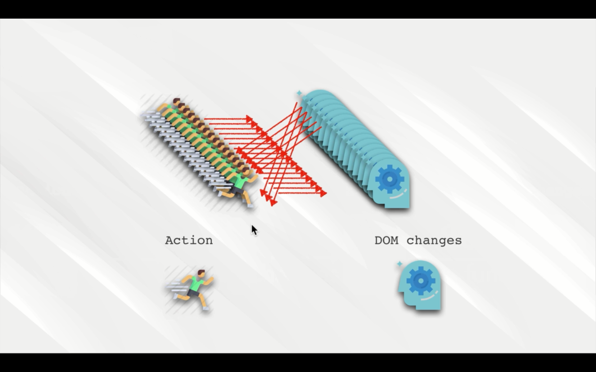

# **Redux**
some component have state some component dont
this is a small project

when the application gets complicated

what redux did

redux change the state from 

to this

this is how old app work

with redux 

Redux architecher

another technology

Prop Drilling

Redux Flow

what is an action

