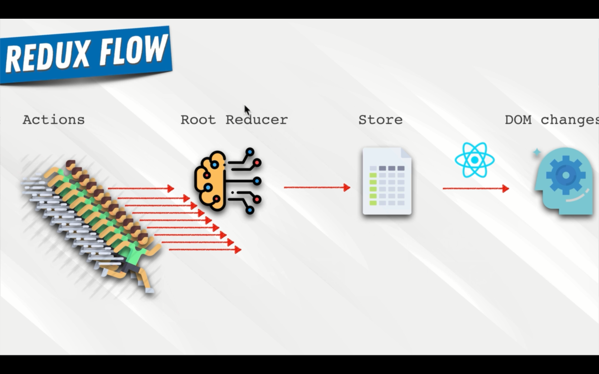

# **Redux**
some component have state some component dont
this is a small project


when the application gets complicated


what redux did


redux change the state from 


to this


this is how old app work


with redux 



Redux architecher


another technology


Prop Drilling


Redux Flow


what is an action


# **intergrating redux into our app**

install following packages

```
napm i redux redux-logger react-redux

```
go to `index.js`
```jsx
import {Provider} from 'react-redux';

```

```jsx

import React from "react";
import ReactDOM from "react-dom";
import "./index.css";
import App from "./App";
import { BrowserRouter } from "react-router-dom";
import {Provider} from 'react-redux'

ReactDOM.render(
-----------------------------------------
  <Provider>
    <BrowserRouter>
      <App />
    </BrowserRouter>
  </Provider>
-----------------------------------------
,
  document.getElementById("root")
);

```

now lets create a redux folder in src

in there create a root-reducer

and user folder

reducer is a function that gets two properties 
it gets a state object which represent a last state  or initial state
then it recives an action

action is an object 
 
```js
 {
    type:'',
    payload:''
}
```

lets create a user reducer

```js
const INITIAL_STATE = {
  currentUser: null
};

const UserReducer = (state = INITIAL_STATE, action) => {
  switch (action.type) {
    case "SET_CURRENT_USER":
      return {
        ...state,
        currentUser: action.payload
      };

    default:
      return state;
  }
};

export default UserReducer;


```

lets create the root reducer

```js
import { combineReducers } from "redux";
import UserReducer from "./user/user.reducer";

export default combineReducers({
  user: UserReducer
});

```

lets create a store 

create a store folder in src
inside create a store.js file

```js
import { createStore, applyMiddleware } from "redux";
import logger from "redux-logger";

import rootReducer from "../root-reducer";

const middleWares = [logger];

const store = createStore(rootReducer, applyMiddleware(...middleWares));

export default store;

```


apply the store in index.js

```js
import React from "react";
import ReactDOM from "react-dom";
import "./index.css";
import App from "./App";
import { BrowserRouter } from "react-router-dom";
import { Provider } from "react-redux";
import store from "./redux/store/store";

ReactDOM.render(
  <Provider store={store}>
    <BrowserRouter>
      <App />
    </BrowserRouter>
  </Provider>,
  document.getElementById("root")
);

```

lets create actions
create a file called `user.actions.js

```js
export const setCurrentUser = user => ({
  action: "SET_CURRENT_USER",
  payload: user
});

```
now our header component gets the current user from app.js but with redux we dont need that


inside the header component 

import `connect`
```js

import { connect } from "react-redux";

```
connect is a higher order component wich gives us access to redux functoions

```jsx
import React from "react";
import "./header.style.scss";
import { Link } from "react-router-dom";
import { ReactComponent as Logo } from "../../assets/crown.svg";
import { auth } from "../../firebase/firebase.utils";
import { connect } from "react-redux";

const Header = ({ currentUser }) => {
  return (
    <div className="header">
      <Link to="/" className="logo-container">
        <Logo className="logo"></Logo>
      </Link>
      <div className="options">
        <Link to="/shop" className="option">
          SHOP
        </Link>
        <Link to="/contact" className="option">
          CONTACT
        </Link>

        {currentUser ? (
          <div className="option" onClick={() => auth.signOut()}>
            SIGN OUT
          </div>
        ) : (
          <Link to="/signin">SIGN IN</Link>
        )}
      </div>
    </div>
  );
};
----------------------------------------------------------
const mapStateToProps = state => ({
  currentUser: state.user.currentUser
});
export default connect(mapStateToProps)(Header);
---------------------------------------------------------
```


and remove current user from app.js <Header>

```jsx
     <Header currentUser={this.state.currentUser} />
```

```jsx
     <Header  />
```

now modify the app.js 

```jsx
import React, { Component } from "react";

import HomePage from "./pages/homepage/homepage.component";
import "./App.css";
import { Route, Switch } from "react-router-dom";
import ShopPage from "./pages/shop/shop.component";
import Header from "./components/header/header.component";
import SignInSignUp from "./components/sign-in-and-sign-up/sign-in-and-sign-up.component";
import { auth, createUserProfileDoucument } from "./firebase/firebase.utils";

import { connect } from "react-redux";
----------------------------------------------------------------------------------------------------------
import { setCurrentUser } from "./redux/user/user.actions";
----------------------------------------------------------------------------------------------------------

class App extends Component {
  // beacuse this is a open subscription we have to close it
  // because we dont need any memory leaks in our application
  unsubscribeFromAuth = null;
  componentDidMount() {
----------------------------------------------------------------------------------------------------------

    const { setCurrentUser } = this.props;
----------------------------------------------------------------------------------------------------------

    this.unsubscribeFromAuth = auth.onAuthStateChanged(async userAuth => {
      if (userAuth) {
        const userRef = await createUserProfileDoucument(userAuth);

        userRef.onSnapshot(snapShot => {
----------------------------------------------------------------------------------------------------------

          setCurrentUser({ currentUser: snapShot.id, ...snapShot.data() });
        });
      } else {
        setCurrentUser(userAuth);
      }
    });
  }
----------------------------------------------------------------------------------------------------------

  // to close the subscription

  componentWillUnmount() {
    // this will close the subscription
    this.unsubscribeFromAuth();
  }
  render() {
    return (
      <div>
        <Header />
        <Switch>
          <Route exact path="/" component={HomePage} />
          <Route path="/shop" component={ShopPage} />
          <Route exact path="/signin" component={SignInSignUp}></Route>
        </Switch>
      </div>
    );
  }
}
----------------------------------------------------------------------------------------------------------

const mapDispatchToProps = dispatch => ({
  setCurrentUser: user => dispatch(setCurrentUser(user))
});

export default connect(null, mapDispatchToProps)(App);
----------------------------------------------------------------------------------------------------------

```

## how to redirect from signin page to home page whe the user signIn
import `Redirect` from react-router-dom;

```jsx
import React, { Component } from "react";
import HomePage from "./pages/homepage/homepage.component";
import "./App.css";
----------------------------------------------------------------------------------------------------------
import { Route, Switch, Redirect } from "react-router-dom";
----------------------------------------------------------------------------------------------------------

import ShopPage from "./pages/shop/shop.component";
import Header from "./components/header/header.component";
import SignInSignUp from "./components/sign-in-and-sign-up/sign-in-and-sign-up.component";
import { auth, createUserProfileDoucument } from "./firebase/firebase.utils";

import { connect } from "react-redux";
import { setCurrentUser } from "./redux/user/user.actions";

class App extends Component {
  // beacuse this is a open subscription we have to close it
  // because we dont need any memory leaks in our application
  unsubscribeFromAuth = null;
  componentDidMount() {
    const { setCurrentUser } = this.props;

    this.unsubscribeFromAuth = auth.onAuthStateChanged(async userAuth => {
      if (userAuth) {
        const userRef = await createUserProfileDoucument(userAuth);

        userRef.onSnapshot(snapShot => {
          setCurrentUser({ currentUser: snapShot.id, ...snapShot.data() });
        });
      } else {
        setCurrentUser(userAuth);
      }
    });
  }

  // to close the subscription

  componentWillUnmount() {
    // this will close the subscription
    this.unsubscribeFromAuth();
  }
  render() {
    return (
      <div>
        <Header />
        <Switch>
          <Route exact path="/" component={HomePage} />
          <Route path="/shop" component={ShopPage} />
----------------------------------------------------------------------------------------------------------

          <Route
            exact
            path="/signin"
            render={() =>
              this.props.currentUser ? (
                <Redirect to="/"></Redirect>
              ) : (
                <SignInSignUp />
              )
            }
          ></Route>
----------------------------------------------------------------------------------------------------------

        </Switch>
      </div>
    );
  }
}
----------------------------------------------------------------------------------------------------------
const mapStateToProps = ({ user }) => ({
  currentUser: user.currentUser
});
----------------------------------------------------------------------------------------------------------

const mapDispatchToProps = dispatch => ({
  setCurrentUser: user => dispatch(setCurrentUser(user))
});
----------------------------------------------------------------------------------------------------------
export default connect(mapStateToProps, mapDispatchToProps)(App);
----------------------------------------------------------------------------------------------------------

```

lets create a actionTypes file

```jsx
export const UserActionTypes = {
  SET_CURRENT_USER: "SET_CURRENT_USER"
};

```

```jsx
import { UserActionTypes } from "./user.actionTypes";
export const setCurrentUser = user => ({
  type: UserActionTypes.SET_CURRENT_USER,
  payload: user
});

```

```jsx
import { UserActionTypes } from "./user.actionTypes";
const INITIAL_STATE = {
  currentUser: null
};

const UserReducer = (state = INITIAL_STATE, action) => {
  switch (action.type) {
    case UserActionTypes.SET_CURRENT_USER:
      return {
        ...state,
        currentUser: action.payload
      };

    default:
      return state;
  }
};

export default UserReducer;

```

lets create a shooping icon component

```jsx
import React from "react";
import "./cart-icon.style.scss";
import { ReactComponent as ShoppingIcon } from "../../assets/shoopingBag.svg";
const CartIcon = () => {
  return (
    <div className="cart-icon">
      <ShoppingIcon className="shopping-icon" />
      <span className="item-count">0</span>
    </div>
  );
};

export default CartIcon;

```
lets style it
```scss
.cart-icon {
  width: 45px;
  height: 45px;
  position: relative;
  display: flex;
  align-items: center;
  justify-content: center;
  cursor: pointer;
  .shopping-icon {
    width: 24px;
    height: 24px;
  }
  .item-count {
    position: absolute;
    font-size: 10px;
    font-weight: bold;
    bottom: 12px;
  }
}

```
add that to header

```jsx
import React from "react";
import "./header.style.scss";
import { Link } from "react-router-dom";
import { ReactComponent as Logo } from "../../assets/crown.svg";
import { auth } from "../../firebase/firebase.utils";
import { connect } from "react-redux";
import CartIcon from "../cart-icon/cart-icon.component";

const Header = ({ currentUser }) => {
  return (
    <div className="header">
      <Link to="/" className="logo-container">
        <Logo className="logo"></Logo>
      </Link>
      <div className="options">
        <Link to="/shop" className="option">
          SHOP
        </Link>
        <Link to="/contact" className="option">
          CONTACT
        </Link>

        {currentUser ? (
          <div className="option" onClick={() => auth.signOut()}>
            SIGN OUT
          </div>
        ) : (
          <Link to="/signin">SIGN IN</Link>
        )}
        <CartIcon/>
      </div>
    </div>
  );
};
const mapStateToProps = state => ({
  currentUser: state.user.currentUser
});
export default connect(mapStateToProps)(Header);

```

lets create Cart dropdown component

```JSX
import React from "react";
import "./cart-dropdown.style.scss";
import CustomButton from "../custom-button/custom-buttom.component";
const CartDropDown = () => {
  return (
    <div className="cart-dropdown">
      <div className="cart-items"></div>
      <CustomButton>GO TO CHEKOUT</CustomButton>
    </div>
  );
};
export default CartDropDown;


```

lets style it
```scss
.cart-dropdown {
  position: absolute;
  width: 240px;
  height: 340px;
  display: flex;
  flex-direction: column;
  padding: 20px;
  border: 1px solid black;
  background-color: white;
  top: 90px;
  right: 40px;
  z-index: 5;

  .cart-items {
    height: 240px;
    display: flex;
    flex-direction: column;
    overflow: scroll;
  }

  button {
    margin-top: auto;
  }
}
```
lets add this to our header

```jsx

import React from "react";
import "./header.style.scss";
import { Link } from "react-router-dom";
import { ReactComponent as Logo } from "../../assets/crown.svg";
import { auth } from "../../firebase/firebase.utils";
import { connect } from "react-redux";
import CartIcon from "../cart-icon/cart-icon.component";
import CartDropdown from '../cart-dropdown/cart-dropdown.component'
const Header = ({ currentUser }) => {
  return (
    <div className="header">
      <Link to="/" className="logo-container">
        <Logo className="logo"></Logo>
      </Link>
      <div className="options">
        <Link to="/shop" className="option">
          SHOP
        </Link>
        <Link to="/contact" className="option">
          CONTACT
        </Link>

        {currentUser ? (
          <div className="option" onClick={() => auth.signOut()}>
            SIGN OUT
          </div>
        ) : (
          <Link to="/signin">SIGN IN</Link>
        )}
        <CartIcon/>
      </div>
      <CartDropdown/>
    </div>
  );
};
const mapStateToProps = state => ({
  currentUser: state.user.currentUser
});
export default connect(mapStateToProps)(Header);

```